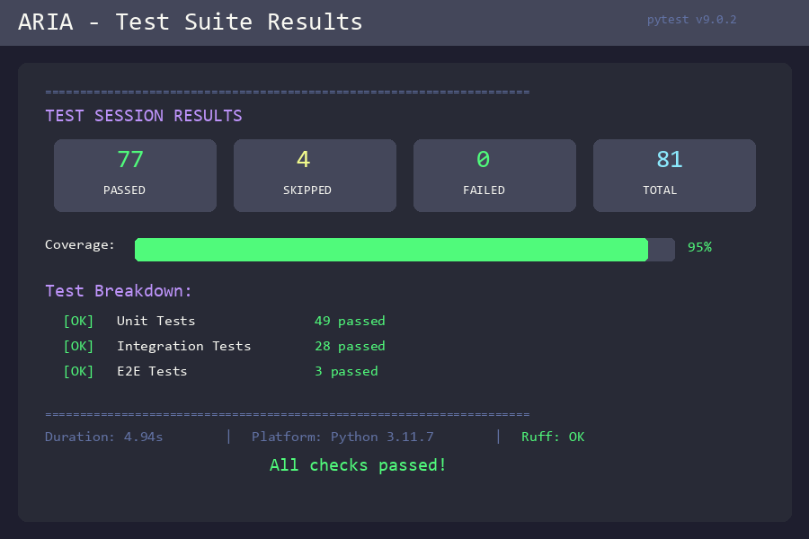

<div align="center">

# ARIA

### Adaptive Reasoning & Intelligent Automation


*An agentic AI system for autonomous task execution with human-in-the-loop safety*

[](https://python.org)
[](LICENSE)
[](tests/)
[](https://github.com/astral-sh/ruff)

[](https://hub.docker.com/r/mahdinavaei/aria)
[](https://huggingface.co/spaces/MadhiNavaei/aria)

[](https://github.com/langchain-ai/langgraph)
[](https://kafka.apache.org/)
[](https://redis.io/)
[](https://qdrant.tech/)

</div>

---

## Why ARIA?

ARIA is not a prompt-chain demo or a single-purpose automation script.

It is a production-grade agentic AI system designed to:
- **Observe real interfaces** using vision
- **Plan and execute actions** safely
- **Learn from outcomes** and human feedback
- **Maintain full auditability** via event sourcing

> **Designed for real-world constraints**
>
> ARIA is built to run with **local LLMs**, supports **both English and Persian**,
> and is optimized for **consumer-grade GPUs (8GB VRAM)**.
> This makes it suitable for privacy-sensitive, cost-aware,
> and resource-constrained environments.

---

## Overview

**ARIA** is a modular, event-sourced AI agent framework designed for complex automation tasks that require visual perception, intelligent planning, and safe execution with human oversight. Built with a cognitive architecture inspired by human cognition (Brain/Eye/Hand/Memory), ARIA can observe, reason, plan, and act autonomously while maintaining safety through human-in-the-loop checkpoints.

The Job Apply automation is the first production plugin built on ARIA, demonstrating the platform's capabilities — not defining its scope.

### Key Differentiators

- **Cognitive Architecture**: Modular Brain (planning), Eye (perception), Hand (execution), Memory (context) design
- **Event Sourcing**: Full audit trail and replay capability via Kafka/Redpanda
- **Human-in-the-Loop**: Safety gates for sensitive actions (CAPTCHA, login, payment)
- **Continuous Learning**: Extracts skills and policies from successful executions
- **Vision-First**: VLM-powered UI understanding with multi-locator fallback

---

## Architecture

ARIA follows a cognitive architecture where perception, reasoning, execution, memory, and learning are explicitly separated, observable, and independently evolvable.

### System Components

```
┌─────────────────────────────────────────────────────────────────────────┐
│                              ARIA Core                                   │
├─────────────────────────────────────────────────────────────────────────┤
│                                                                          │
│   ┌─────────┐    ┌─────────┐    ┌─────────┐    ┌─────────────────────┐  │
│   │  Brain  │◄──►│   Eye   │◄──►│  Hand   │◄──►│   Memory Manager    │  │
│   │ Planner │    │ VLM/OCR │    │ Actions │    │ Working/Episodic/   │  │
│   │Executor │    │ UIRef   │    │ Browser │    │ Semantic            │  │
│   │Observer │    │Screenshot│   │ Desktop │    └─────────────────────┘  │
│   │  HITL   │    └─────────┘    │   ML    │                             │
│   └─────────┘                   └─────────┘                             │
│        │                             │                                   │
│        ▼                             ▼                                   │
│   ┌─────────────────────────────────────────────────────────────────┐   │
│   │                    Event Bus (Kafka/Redpanda)                    │   │
│   └─────────────────────────────────────────────────────────────────┘   │
│        │                             │                                   │
│        ▼                             ▼                                   │
│   ┌──────────────┐           ┌──────────────┐                           │
│   │ State Store  │           │ Vector Store │                           │
│   │   (Redis)    │           │   (Qdrant)   │                           │
│   └──────────────┘           └──────────────┘                           │
│                                                                          │
├─────────────────────────────────────────────────────────────────────────┤
│                           Plugins & Adapters                             │
├─────────────────────────────────────────────────────────────────────────┤
│   ┌────────────────┐  ┌────────────────┐  ┌────────────────┐            │
│   │  Job Apply     │  │  Browser-Use   │  │   OpenAdapt    │            │
│   │  (LinkedIn,    │  │  (Playwright)  │  │  (Recording)   │            │
│   │   Indeed)      │  │                │  │                │            │
│   └────────────────┘  └────────────────┘  └────────────────┘            │
└─────────────────────────────────────────────────────────────────────────┘
```

<div align="center">


*End-to-end workflow: Planning → Observation → Execution → Safety Gates → Learning*

</div>

---

## Features

### Core Capabilities

- **Event-sourced execution** with full replay support
- **Human-in-the-loop safety** for sensitive actions
- **Continuous learning** from successful executions
- **Vision-first UI understanding** with fallback strategies
- **Multi-adapter execution** (Browser, Desktop, ML inference)
- **Three-tier memory** (Working, Episodic, Semantic)

### Production Features

- **Persian Language Support**: Native Farsi STT (Whisper) and embedding models
- **Real-time UI**: Streamlit dashboard with live browser view and activity logs
- **REST API & WebSocket**: Full programmatic control and real-time updates

<div align="center">


*Complete system flow: Event-driven architecture with continuous learning loop*

</div>

---

## Quick Start

### Prerequisites

- Python 3.11+
- Docker & Docker Compose
- 8GB+ RAM recommended
- **LLM Models**: See [MODELS.md](Docs/English/MODELS.md) for download instructions

### Minimal Run (Headless)

ARIA can be run without UI for experimentation:

```bash
# Start infrastructure services
docker compose up -d

# Run basic agent (example)
python examples/run_basic_agent.py
```

This minimal setup skips UI and learning components and is intended for quick experimentation and validation.

### Installation

```bash
# Clone the repository
git clone https://github.com/mahdinavaei/aria.git
cd aria

# Create virtual environment
python -m venv .venv

# Activate (Linux/macOS)
source .venv/bin/activate

# Activate (Windows PowerShell)
.\.venv\Scripts\Activate.ps1

# Install dependencies
pip install -e ".[dev]"

# Copy environment configuration
cp .env.example .env

# Create required directories (if they don't exist)
mkdir -p data/profiles data/jobs data/applications data/artifacts logs

# Download LLM models (required)
# See Docs/English/MODELS.md for detailed instructions
python scripts/download_models.py --models core

# Start infrastructure services
docker compose up -d

# Verify services are healthy
docker compose ps
```

> **⚠️ Important**: LLM model files are **not included** in this repository. You must download them separately. See [MODELS.md](Docs/English/MODELS.md) for complete setup instructions.

### Required Files & Directories

The following files and directories are **not included** in the repository and will be created automatically or need to be set up:

| Item | Status | How to Create |
|------|--------|---------------|
| `.env` | ⚠️ Required | Copy from `.env.example`: `cp .env.example .env` |
| `data/` directories | ✅ Auto-created | Created automatically on first run, or manually: `mkdir -p data/profiles data/jobs data/applications` |
| `artifacts/` directory | ✅ Auto-created | Created automatically by the learning system |
| `logs/` directory | ✅ Auto-created | Created automatically when logging starts |
| LLM model files | ⚠️ Required | Download separately - see [MODELS.md](Docs/English/MODELS.md) |

**Note:** All runtime directories (`data/`, `artifacts/`, `logs/`) are gitignored and will be created automatically when needed. You only need to create `.env` from `.env.example` and download LLM models.

### Running the Application

```bash
# Start the API server
uvicorn aria.api.main:app --host 0.0.0.0 --port 8000

# In another terminal, start the Streamlit UI
streamlit run src/aria/ui/app.py
```

Access the dashboard at `http://localhost:8501`

---

## Model Setup

**⚠️ Important**: LLM model files are **not included** in this repository due to their large size. You must download them separately before running ARIA.

### Quick Setup

```bash
# Option 1: Use the automated download script (recommended)
pip install huggingface-hub
python scripts/download_models.py --models core

# Option 2: Download manually using Ollama
ollama pull qwen2.5:7b

# Option 3: Download from HuggingFace (see Docs/English/MODELS.md for links)
```

### Detailed Instructions

For complete model setup instructions, including:
- Required vs optional models
- Download links and methods
- Configuration and verification
- Troubleshooting

👉 **See [MODELS.md](Docs/English/MODELS.md)** for the complete guide.

---

## Project Structure

```
aria/
├── src/aria/
│   ├── adapters/          # External service adapters
│   ├── api/               # FastAPI REST & WebSocket
│   ├── core/              # Core components (Brain, Eye, Hand, Memory)
│   ├── plugins/           # Domain plugins (Job Apply, etc.)
│   └── ui/                # Streamlit dashboard
├── config/                # YAML configuration files
├── tests/                 # Test suite (81 tests)
└── Docs/                  # Documentation
```

See full structure and module responsibilities in [Docs/English/project-structure.md](Docs/English/project-structure.md).

---

## Configuration

ARIA uses a layered configuration system:

1. **YAML files** in `config/` (base settings)
2. **Environment variables** (overrides)
3. **`.env` file** (local development)

Key configuration files:

| File | Purpose |
|------|---------|
| `config/default.yaml` | Base configuration |
| `config/llm.yaml` | LLM provider settings (Ollama/OpenAI) |
| `config/memory.yaml` | Memory tiers and vector store |
| `config/eye.yaml` | VLM and screenshot settings |
| `config/hand.yaml` | Browser/desktop automation |
| `config/job_apply.yaml` | Job application plugin |

---

## Testing

<div align="center">



</div>

```bash
# Run all tests
pytest tests/ -v

# Run unit tests only (fast, no dependencies)
pytest tests/unit/ -v

# Run integration tests (requires Docker services)
docker compose up -d
pytest tests/integration/ -v

# Run end-to-end tests
ARIA_RUN_E2E=1 pytest tests/e2e/ -v -m e2e

# Code quality checks
ruff check src/aria/
ruff check tests/
mypy src/aria/
```

**Test Coverage:**
- Unit Tests: 49 tests covering core logic
- Integration Tests: 28 tests with real services
- E2E Tests: 3 full workflow tests
- **Total: 81 tests (77 passed, 4 skipped intentionally)**

---

## Documentation

Comprehensive documentation is available in the `Docs/` directory:

- **[Architecture Overview](Docs/English/architecture.md)** - System design and components
- **[Project Structure](Docs/English/project-structure.md)** - Codebase organization
- **[Event Model](Docs/English/event-model.md)** - Event sourcing design
- **[Testing Strategy](Docs/English/testing-strategy.md)** - Test approach and coverage
- **[Model Setup Guide](Docs/English/MODELS.md)** - LLM model download and configuration

### Architecture Decision Records (ADRs)

- [ADR-001: Event Sourcing](Docs/English/adr/ADR-001-event-sourcing.md)
- [ADR-006: HITL First-Class](Docs/English/adr/ADR-006-hitl-first-class.md)
- [ADR-007: Vision Fallback](Docs/English/adr/ADR-007-vision-fallback.md)

---

## Tech Stack

| Category | Technologies |
|----------|-------------|
| **Orchestration** | LangGraph, LangChain |
| **LLM** | Ollama (local), OpenAI (cloud) |
| **Vision** | Qwen-VL, custom VLM models |
| **Automation** | Playwright, PyAutoGUI, PyWinAuto |
| **Event Streaming** | Redpanda (Kafka-compatible) |
| **State Store** | Redis |
| **Vector DB** | Qdrant |
| **Memory** | Mem0 |
| **API** | FastAPI, WebSockets |
| **UI** | Streamlit |
| **Testing** | pytest, pytest-asyncio |
| **Code Quality** | Ruff, MyPy |

---

## Roadmap (High-Level)

ARIA is under active development. Upcoming work focuses on:

- **Production Hardening**  
  Deployment profiles, resource isolation, and operational tooling

- **Plugin Ecosystem**  
  Additional plugins (Email, Calendar, CRM)

- **Advanced Observability**  
  Outcome analytics, replay-based debugging

- **Security & Governance**  
  Fine-grained permissions and audit controls

Detailed design discussions are captured in the documentation and ADRs.

---

## Security

Security is a core design principle in ARIA. For information about:

- Reporting security vulnerabilities
- Supported versions and security updates
- Security best practices for deployment
- Incident response procedures

Please see our [Security Policy](SECURITY.md).

**⚠️ Security Reminder:**
- Never commit `.env` files or credentials to version control
- Use local LLMs to avoid data exfiltration
- Enable Human-in-the-Loop (HITL) safety gates for production use
- Review the security documentation before deploying to production

---

## Contributing

Contributions are welcome! Please read [CONTRIBUTING.md](CONTRIBUTING.md) for:

- Code style guidelines (Ruff, type hints)
- Commit message conventions
- Pull request process
- Testing requirements

---

## License

This project is licensed under the **GNU Affero General Public License v3.0 (AGPL-3.0)** - see the [LICENSE](LICENSE) file for details.

### What This Means

**AGPL v3** is a strong copyleft license that ensures software freedom:

✅ **You CAN:**
- Use ARIA for any purpose (personal, commercial, research)
- Modify and distribute ARIA
- Use ARIA as a network service (API, SaaS, web app)

⚠️ **You MUST:**
- Provide source code to users who interact with your modified version over a network
- License your modifications under AGPL v3
- Keep all copyright and license notices intact
- Disclose your source code if you run ARIA as a network service

📋 **Additional Information:**
- [THIRD_PARTY_LICENSES.md](THIRD_PARTY_LICENSES.md) - Complete list of all third-party licenses
- [LICENSE_COMPLIANCE.md](LICENSE_COMPLIANCE.md) - Detailed compliance guide and FAQs

### Why AGPL v3?

ARIA includes components licensed under AGPL v3 (AIHawk, Skyvern), which ensures:
- The entire ecosystem remains open-source
- Network service operators must share their improvements
- Users always have access to the source code

**Note:** If you need a more permissive license for your use case, you can remove the AGPL-licensed components and use only the MIT-licensed parts (browser-use, OpenAdapt). See [LICENSE_COMPLIANCE.md](LICENSE_COMPLIANCE.md) for details.

---

## Author

<div align="center">

This project reflects real-world experience building and operating LLM-powered systems in production environments.

**Mahdi Navaei**

*Senior AI/ML Engineer | GenAI (LLM/RAG) | ML Platform/MLOps*

[](mailto:mahdinavaei1367@gmail.com)
[](https://linkedin.com/in/mahdinavaei)
[](https://mahdinavaei.github.io/resume-site)

</div>

---

<div align="center">

*Built with passion for intelligent automation*

If you find this project useful, please consider giving it a star!

</div>
