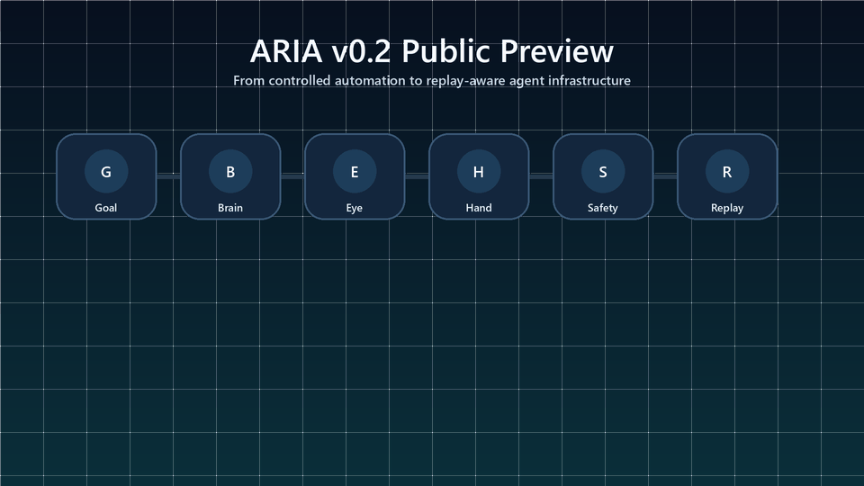
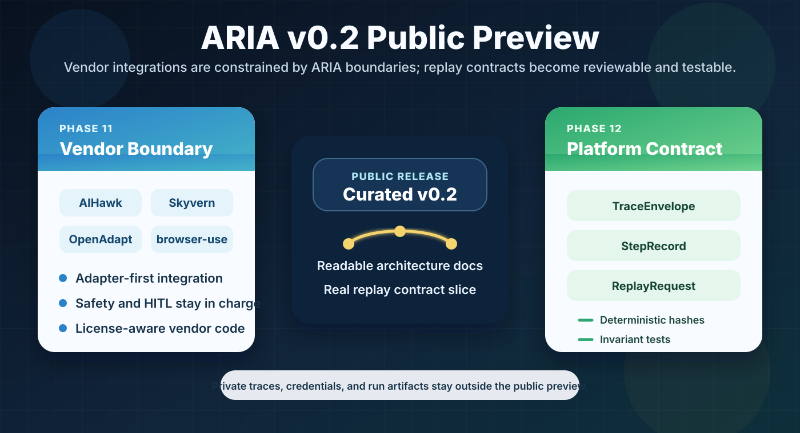

<div align="center">

# ARIA

### Adaptive Reasoning & Intelligent Automation


**A contract-first agentic AI engineering platform for observable, replay-aware, human-supervised automation.**

[](https://python.org)
[](LICENSE)
[](Docs/English/phases/README.md)
[](tests/unit/test_replay_trace.py)

[](https://github.com/langchain-ai/langgraph)
[](https://fastapi.tiangolo.com/)
[](https://redis.io/)
[](https://qdrant.tech/)

</div>

---

## Why ARIA Exists

ARIA is built for the engineering problems that appear after an agent demo starts becoming a system: structured planning, tool boundaries, runtime safety, human approval, traceability, replay, and learning from execution outcomes.

ARIA separates the system into explicit runtime planes:

- **Brain**: planning, reasoning, orchestration, HITL routing, and state transitions.
- **Eye**: screenshot capture, VLM/OCR perception, UI state recognition, and UIRef extraction.
- **Hand**: browser, desktop, ML, and vendor-backed execution adapters.
- **Memory**: working, episodic, semantic, and learning-oriented memory layers.
- **Safety**: domain policy, risk detection, PII protection, captcha handling, rate limits, and human approval gates.
- **Event & Replay**: structured events, trace ids, step ids, deterministic trace envelopes, and audit-friendly execution history.

The result is not a single automation bot. It is a platform architecture for building reliable agentic workflows under real-world constraints.

---

## At a Glance

| Area | Public v0.2 Snapshot |
|---|---|
| System type | Agentic AI engineering platform |
| Architecture | Brain / Eye / Hand / Memory / Safety / Event & Replay |
| Orchestration | LangGraph-style state-machine execution |
| Runtime surfaces | FastAPI, WebSocket, legacy Streamlit operator UI |
| Safety posture | HITL-first, domain-aware, PII-aware, rate-limited |
| Public code slice | Replay trace contracts and Job Apply model restoration |
| Verification | 96 unit tests passing; 27 integration tests passing, 7 skipped |
| License | AGPL-3.0-or-later |

---

## What This Repository Demonstrates

This public release is designed to show engineering judgment, not only feature count:

- how an agent runtime is separated into durable system boundaries,
- how planning and execution are kept apart through capability contracts,
- how sensitive actions route through Safety and HITL,
- how traces can be shaped for deterministic replay and audit,
- how a domain plugin can sit on top of the platform instead of becoming the platform,
- how a private research workspace can be published as a clean, reviewable public release.

---

## Visual Overview

<p align="center">
  
</p>

<p align="center">
  
</p>

<p align="center">
  
</p>

---

## Current Public Release

This repository is a **curated public preview** of ARIA.

The earlier public line, `v0.1.x`, covered the first foundation phases. The current `v0.2` preview refreshes those foundations and publishes the architecture up to **Phase 12** without dumping the full private workspace.

### What v0.2 Publishes

- Refreshed public documentation for **Phase 00 through Phase 12**.
- A clearer architecture story from infrastructure to core completion.
- A small but real replay/trace contract module:
  - `TraceEnvelope`
  - `StepRecord`
  - `ReplayRequest`
  - deterministic content hashing
  - Pydantic validation of replay-critical invariants
- Targeted tests for the replay contract slice.
- A roadmap for the next public releases: observability, artifacts/replay hardening, trust governance, MCP, and control-plane UI.

<p align="center">
  
</p>

### What Remains Private

Some newer internal work is intentionally not published in this preview: large evidence artifacts, private run outputs, QLoRA experiments, long-horizon planning work, advanced policy-learning internals, full Next.js control-plane implementation, private traces, and environment-specific runtime data.

That boundary is deliberate. The public repo is meant to be readable, reviewable, and safe to evaluate.

---

## Reviewer Path

If you are reviewing this project quickly, start here:

1. Read this README for the system story and public/private boundary.
2. Open [Phase 12: Platform Consolidation](Docs/English/phases/phase-12-platform-consolidation.md) to understand the v0.2 architecture checkpoint.
3. Inspect [src/aria/core/replay/trace.py](src/aria/core/replay/trace.py) for the public replay contract.
4. Run [tests/unit/test_replay_trace.py](tests/unit/test_replay_trace.py) for the smallest verification slice.
5. Browse [Docs/English/phases/README.md](Docs/English/phases/README.md) for the phased release map.

---

## Architecture Snapshot

```text
                             ARIA Runtime

   User / API / UI
        |
        v
   +----------------------+       +----------------------+
   | Brain                |<----->| Memory               |
   | planner / executor   |       | working / episodic   |
   | observer / HITL      |       | semantic / learning  |
   +----------+-----------+       +----------+-----------+
              |                              ^
              v                              |
   +----------------------+       +----------+-----------+
   | Safety & Policy      |<----->| Event / Trace Plane  |
   | risk / PII / HITL    |       | envelope / replay    |
   | domain / rate limit  |       | audit / evidence     |
   +----------+-----------+       +----------+-----------+
              |
              v
   +----------------------+       +----------------------+
   | Hand                 |<----->| Eye                  |
   | browser / desktop    |       | screenshots / VLM    |
   | tools / vendors      |       | OCR / UIRef          |
   +----------------------+       +----------------------+
```

The main design choice is explicit separation of responsibilities. The Brain should not know browser internals. The Hand should not invent policy. The Eye should describe state, not execute actions. The Event/Trace plane should make every meaningful action reconstructable.

---

## Phase Timeline

The public `v0.2` release line now documents the project through Phase 12.

| Phase | Public Status | Focus |
|---|---:|---|
| [00](Docs/English/phases/phase-00-foundation.md) | refreshed | Repository, configuration, Docker, logging, and base layout |
| [01](Docs/English/phases/phase-01-events-data.md) | refreshed | Event envelope, Kafka/Redpanda, Redis state, topic taxonomy |
| [02](Docs/English/phases/phase-02-memory.md) | refreshed | Working, episodic, semantic memory and vector storage |
| [03](Docs/English/phases/phase-03-brain.md) | refreshed | LangGraph Brain, planner, executor, observer, HITL |
| [04](Docs/English/phases/phase-04-eye.md) | refreshed | Screenshot, VLM/OCR perception, UIRef extraction |
| [05](Docs/English/phases/phase-05-hand.md) | refreshed | Browser/desktop execution adapters and capability routing |
| [06](Docs/English/phases/phase-06-job-apply.md) | refreshed | First domain plugin: job search, matching, application flow |
| [07](Docs/English/phases/phase-07-learning.md) | refreshed | Skill extraction, policy learning, feedback loops |
| [08](Docs/English/phases/phase-08-ui.md) | refreshed | Operator UI, live view, HITL, bilingual/RTL support |
| [09](Docs/English/phases/phase-09-testing.md) | refreshed | Unit, integration, E2E, CI, documentation hardening |
| [10](Docs/English/phases/phase-10-safety.md) | refreshed | Safety gate, domain policy, PII, captcha, rate limits |
| [11](Docs/English/phases/phase-11-vendor-integrations.md) | public preview | AIHawk, Skyvern, OpenAdapt, browser-use integration boundaries |
| [12](Docs/English/phases/phase-12-platform-consolidation.md) | public preview | Core completion, event-bus abstraction, trace/replay contracts |

See the full phase index: [Docs/English/phases/README.md](Docs/English/phases/README.md).

---

## Public v0.2 Code Slice

The code added in this preview is intentionally small and reviewable:

```text
src/aria/core/replay/
├── __init__.py
└── trace.py

tests/unit/
└── test_replay_trace.py
```

It introduces replay-safe contracts without exposing private traces or internal evidence:

- terminal traces require `completed_at`,
- failed steps require an explicit `error`,
- step ids are unique within a trace,
- trace hashes are deterministic,
- replay requests can verify integrity before execution.

---

## Verification Snapshot

The latest local verification for this public branch passed:

```text
pytest tests/unit -q
# 96 passed

pytest tests/integration -q
# 27 passed, 7 skipped

ruff check src/aria/core/replay src/aria/plugins/job_apply/models \
  tests/unit/test_replay_trace.py tests/unit/plugins/job_apply \
  tests/integration/test_hand.py tests/integration/test_brain_graph.py \
  --select E,F,I,ANN,UP,DTZ,TC,PLC,PLW
# All checks passed
```

The skipped integration tests are service-dependent paths that require external runtime services such as Redis/Redpanda in specific configurations.

---

## Quick Start

### Prerequisites

- Python 3.11+
- Docker and Docker Compose
- Redis, Redpanda/Kafka, and Qdrant for full integration scenarios
- Local or remote LLM provider configured through environment variables

### Install

```bash
git clone https://github.com/MahdiNavaei/aria.git
cd aria

python -m venv .venv

# Windows PowerShell
.\.venv\Scripts\Activate.ps1

# Linux/macOS
source .venv/bin/activate

pip install -e ".[dev]"
cp .env.example .env
```

### Run the Targeted v0.2 Verification

```bash
pytest tests/unit/test_replay_trace.py -q
ruff check src/aria/core/replay tests/unit/test_replay_trace.py
```

Expected targeted result:

```text
4 passed
All checks passed
```

### Run the API and Legacy UI

```bash
docker compose up -d
uvicorn aria.api.main:app --host 0.0.0.0 --port 8000
streamlit run src/aria/ui/app.py
```

The legacy Streamlit dashboard is available at `http://localhost:8501`.

---

## Repository Layout

```text
aria/
├── src/aria/
│   ├── adapters/          # Browser, desktop, Redis, Kafka, ML adapters
│   ├── api/               # FastAPI routes and WebSocket runtime
│   ├── core/
│   │   ├── brain/         # Planner, executor, observer, HITL graph nodes
│   │   ├── eye/           # Screenshot, VLM/OCR, UIRef perception
│   │   ├── hand/          # Capability abstraction and execution boundary
│   │   ├── learning/      # Skill extraction and policy feedback
│   │   ├── memory/        # Working, episodic, semantic memory
│   │   ├── replay/        # v0.2 public trace/replay contract
│   │   └── safety/        # Domain, risk, PII, captcha, rate-limiting
│   ├── plugins/           # Domain plugins, starting with job apply
│   └── ui/                # Legacy Streamlit operator surface
├── config/                # YAML configuration
├── Docs/English/          # Public architecture and phase docs
├── tests/                 # Unit, integration, and E2E tests
└── vendor/                # Vendored integrations and license-governed sources
```

---

## Engineering Principles

ARIA is built around production-oriented agent constraints:

- **Schema-first boundaries**: agent state, tool calls, traces, and replay requests are structured.
- **Human authority**: sensitive actions route through HITL instead of silent execution.
- **Auditability**: every serious runtime path should be explainable through ids, events, and artifacts.
- **Local-first capability**: local LLMs and local state stores are first-class for privacy and cost control.
- **Progressive public releases**: new private capabilities are published only after they can be explained, tested, and separated from private artifacts.

---

## Next Public Phases

The next public releases should be staged rather than dumped all at once.

### Phase 13: Observability and Runtime Telemetry

Goal: publish the first clean observability slice with structured logs, metrics naming, trace correlation, latency budgets, and operator-facing health signals.

Expected public outputs:

- trace context propagation notes,
- metric taxonomy,
- health and readiness documentation,
- minimal tests around trace ids and event correlation.

### Phase 14: Artifacts, Evidence Packs, and Replay Hardening

Goal: show how ARIA records execution evidence without leaking private data. This phase should introduce artifact manifests, redaction rules, replay-safe summaries, and failure records.

Expected public outputs:

- artifact manifest schema,
- redaction policy notes,
- replay/failure examples with synthetic data,
- evidence-pack validation tests.

### Phase 15: Trust Envelope and Governance Gates

Goal: document and publish a first governance layer around approvals, risk levels, trust scopes, RBAC expectations, and policy-gated execution.

Expected public outputs:

- trust envelope schema,
- approval lifecycle,
- safety escalation matrix,
- policy compatibility tests.

Later public releases can then introduce MCP runtime selection, frontend control-plane previews, learning evaluation, and adaptive routing as separate, readable milestones.

---

## Documentation

Core docs:

- [Architecture Overview](Docs/English/architecture.md)
- [Project Structure](Docs/English/project-structure.md)
- [Event Model](Docs/English/event-model.md)
- [Safety and Guardrails](Docs/English/safety-and-guardrails.md)
- [Testing Strategy](Docs/English/testing-strategy.md)
- [Phase Index](Docs/English/phases/README.md)

Key ADRs:

- [ADR-001: Event Sourcing](Docs/English/adr/ADR-001-event-sourcing.md)
- [ADR-002: Brain/Hand Capability Contract](Docs/English/adr/ADR-002-brain-hand-capability-contract.md)
- [ADR-006: HITL First-Class](Docs/English/adr/ADR-006-hitl-first-class.md)
- [ADR-009: Safety Gates](Docs/English/adr/ADR-009-safety-gates.md)

---

## License

ARIA is licensed under the **GNU Affero General Public License v3.0 or later**. See [LICENSE](LICENSE), [NOTICE](NOTICE), [THIRD_PARTY_LICENSES.md](THIRD_PARTY_LICENSES.md), and [LICENSE_COMPLIANCE.md](LICENSE_COMPLIANCE.md).

The AGPL license is intentional because ARIA includes AGPL-governed vendor components and is designed for network-accessible agent runtimes.

---

## Author

<div align="center">

**Mahdi Navaei**

Senior AI/ML Engineer | GenAI, LLM/RAG, Agentic Systems, ML Platform

[](mailto:mahdinavaei1367@gmail.com)
[](https://linkedin.com/in/mahdinavaei)
[](https://mahdinavaei.github.io/resume-site)

</div>
